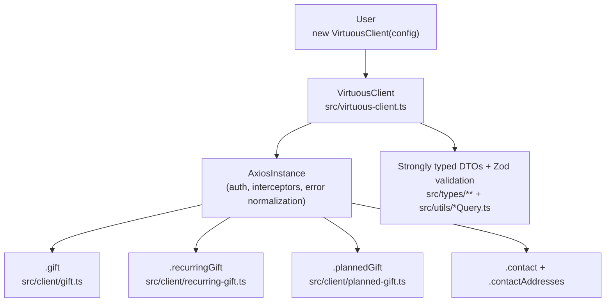

# virtuous-ts

**virtuous-ts** was developed by **Spencer Hardy** while working at [Animal Aid Unlimited](https://www.animalaidunlimited.com/).

[](https://www.npmjs.com/package/virtuous-ts)
[](https://opensource.org/licenses/MIT)
[](https://www.typescriptlang.org/)

A lightweight, fully-typed TypeScript client library for the [Virtuous CRM API](https://www.virtuoussoftware.com/).

**Features:**
- Type-safe clients for Gifts, Recurring Gifts, Planned Gifts, Contacts, and Contact Addresses
- Query builder helpers for complex searches
- `update*Safely()` helpers to handle Virtuous' requirement for full objects on updates
- Centralized error handling with `VirtuousApiError`
- Zero dependencies beyond `axios` and `zod`

## Installation

```bash
npm install virtuous-ts
```

Or with yarn/pnpm:

```bash
yarn add virtuous-ts
# or
pnpm add virtuous-ts
```

## Quick Start

### Load the VirtuousClient

### Setup Environment Variables

Copy the example .env file and add your API key:

```bash
cp .env-example .env
```

#### Load the VirtuousClient

```typescript
import { VirtuousClient } from 'virtuous-ts';

const virtuous = new VirtuousClient({
  baseURL: 'https://api.virtuoussoftware.com/api/',
  apiKey: process.env.VIRTUOUS_API_KEY!,
  timeout: 30_000, //optional
});
```

#### Create a gift (preferred Virtuous way)

This preferred method uses Virtuous' smart contact matching. Note that these requests are batch processed at midnight daily, so results may not appear immediately. Use when you do not have concrete `contactId` / `contactIndividualId` values.

```typescript
await virtuous.gift.createGiftTransaction({
  transactionSource: 'Website',
  contact: {
    email: 'sarah@example.com',
    firstname: 'Sarah',
    lastname: 'Smith',
  },
  giftType: 'Cash',
  amount: '100.00',
  giftDate: '2025-04-05',
  frequency: 'OneTime',  // required by API
});
```

#### Create a gift directly (only advisable if you have the contactId and contactIndividualId)

```typescript
const gift = await virtuous.gift.createGift({
  transactionSource: 'API Test',
  transactionId: 'Spencer-Test-1121',
  contactId: 12345,
  contactIndividualId: 76543,
  giftType: 'Cash',
  amount: 10,
  giftDate: new Date().toISOString().split('T')[0],
  notes: 'This is a test gift from the API',
  isPrivate: false,
  isTaxDeductible: true,
});
```

#### Query Helpers
There are query builders/helpers for contact, gifts, planned gifts and recurring gifts. They take the format of a simple object with the filters you want to apply and return a fully formed query request object that can be passed to the query functions. They are in the format of '[SearchItemName][QueryParameter]' i.e. 'ContactIdIs', 'GiftDateYear', 'GiftDateFrom', 'GiftDateTo', 'ContactNameContains', etc.


#### Search gifts

```typescript
// Import the Gift Query builder
import { buildGiftQuery } from 'virtuous-ts';

const queryGiftRequest = buildGiftQuery({
  giftDateYear: 2025,  // number or string "2025" both supported
  amountMin: 1000,
  sortBy: 'Gift Date',
  descending: true,
});

// Pass the query request to one of the query methods (pagination via 2nd param)
const results = await virtuous.gift.queryGiftsWithFullDetails(
  queryGiftRequest,
  { skip: 0, take: 50 }
);
```

### Safe Updates

Virtuous requires every field to be populated for the `UpdateGiftRequest` (or `UpdateRecurringGiftRequest`, `UpdatePlannedGiftRequest`) object to be sent with every update — even if you’re only changing one field. Omitting fields causes them to be set to be deleted

`updateGiftSafely()` and `updateRecurringGiftSafely()` and `updatePlannedGiftSafely()` fix this by first downloading the full gift/recurring gift/planned gift object and then pre populating the request objects with current valid data. The changes are then overlaid allowing for one field updates.

**only pass the fields you want to change**

```ts
await virtuous.gift.updateGiftSafely(giftId, {
  amount: 150.0,
  notes: 'Donor increased pledge',
});

await virtuous.recurringGift.updateRecurringGiftSafely(id, {
  amount: 75,
  frequency: 'Quarterly',
});

await virtuous.plannedGift.updatePlannedGiftSafely(plannedGiftId, {
  anticipatedAmount: 1000,
  frequency: 'Monthly',
});
```

### Available Clients

- `virtuous.gift` - Gifts and gift transactions
- `virtuous.recurringGift` - Recurring gifts and payments
- `virtuous.plannedGift` - Planned gifts / pledges
- `virtuous.contact` - Contacts, search, receipts
- `virtuous.contactAddresses` - Contact address CRUD

See the full [type definitions](src/types/) and JSDoc in source for complete API.

### Error Handling

All API errors are normalized to `VirtuousApiError`:

```typescript
import { VirtuousApiError } from 'virtuous-ts';

try {
  await virtuous.gift.getGift(99999);
} catch (error) {
  if (error instanceof VirtuousApiError) {
    if (error.isNotFound) {
      console.log('Not found');
    } else if (error.isRateLimited) {
      // handle rate limit
    } else if (error.isValidationError) {
      console.log(error.validationErrors);
    }
    console.error(error.message, error.status, error.code);
  }
}
```

### Query Builders

The `build*Query` helpers simplify creating `QueryRequest` objects for the complex Virtuous query syntax.

**Available builders:**
- `buildGiftQuery(filters: SimpleGiftFilters)`
- `buildContactQuery(filters: SimpleContactFilters)`
- `buildRecurringGiftQuery(filters: SimpleRecurringGiftFilters)`
- `buildPlannedGiftQuery(filters: SimplePlannedGiftFilters)`

See `Simple*Filters` interfaces in `src/utils/` for all supported filters (e.g. `giftDateYear`, `amountMin`, `contactNameContains`, `sortBy`, `descending`, etc.). Year fields accept `string | number`.

Pagination uses the optional second parameter to query methods: `{ skip?: number; take?: number }`.

Example for planned gifts (similar for others):

```typescript
import { buildPlannedGiftQuery } from 'virtuous-ts';

const query = buildPlannedGiftQuery({
  anticipatedAmountMin: 1000,
  createdDateYear: 2025,
  sortBy: 'Anticipated Amount',
  descending: true,
});

const results = await virtuous.plannedGift.queryPlannedGifts(query);
```


### Architecture

The library uses a facade pattern with a shared Axios instance:



See `src/index.ts` for the full public API surface.

### Contributing

1. Clone the repo
2. `npm install`
3. `npm run build`
4. Add tests in `tests/` (note: integration tests hit live API)
5. Update types, clients, README as needed
6. Submit PR to https://github.com/animalaidunlimited/virtuous-ts

Issues, feature requests, and PRs welcome!

### License

This project is licensed under the [MIT License](LICENSE) - see the LICENSE file for details.

---

**First public release (v0.1.0)** - Feedback appreciated! Star the repo if useful.
